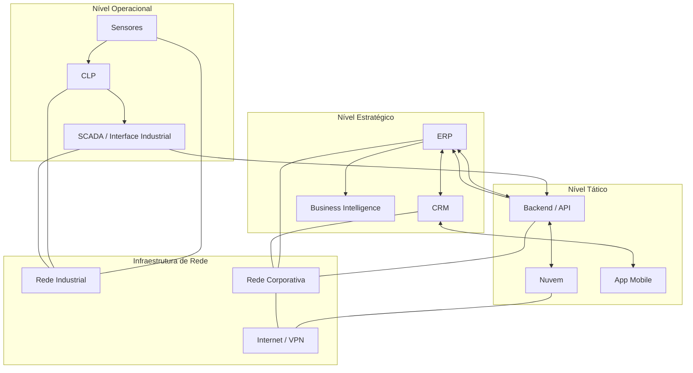

# 📊 Mapa de Integração Vertical e Horizontal
**Disciplina:** Integração Vertical e Horizontal
**Curso:** Análise e Desenvolvimento de Sistemas

---

# 1. Objetivo

Representar a integração vertical e horizontal em uma arquitetura empresarial moderna, considerando:

- Sensores industriais
- Interfaces industriais (IHMs / SCADA)
- Redes industriais e corporativas
- Backend
- ERP
- CRM
- Nuvem
- Aplicação Mobile

---

# 2. Conceito Aplicado

## 🔷 Integração Vertical

Fluxo entre níveis hierárquicos:

Operacional → Tático → Estratégico

Exemplo:
- Sensor coleta dado
- Backend processa
- ERP consolida
- Diretoria toma decisão

---

## 🔷 Integração Horizontal

Integração entre sistemas no mesmo nível:

- ERP ↔ CRM
- Backend ↔ Nuvem
- Produção ↔ Logística
- Mobile ↔ CRM

---

# 3. Arquitetura Geral

A arquitetura abaixo representa:

- Camadas verticais (níveis)
- Comunicação horizontal entre sistemas
- Uso de redes industriais e rede corporativa
- Integração com nuvem

---

# 4. Diagrama em Mermaid

## 5. Explicação do Fluxo

### 🔹 Operacional

- Sensores capturam dados físicos (temperatura, pressão, produção).
- CLP processa sinais.
- SCADA apresenta dados em tempo real.

### 🔹 Tático

- Backend recebe dados via API.
- Dados podem ser enviados para a nuvem.
- Aplicativo mobile consome informações estratégicas.

### 🔹 Estratégico

- ERP consolida dados produtivos.
- CRM gerencia clientes e pedidos.
- BI gera relatórios para tomada de decisão.

## 6. Conclusão

- A integração vertical conecta chão de fábrica à diretoria.
- A integração horizontal conecta sistemas no mesmo nível.
- Redes industriais e corporativas garantem comunicação.
- A nuvem amplia escalabilidade.
- O mobile democratiza acesso à informação.
